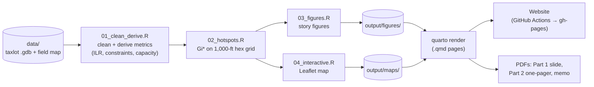

# Missoula Housing Capacity — GIS Data Story

**Website: <https://www.kaseyzapatka.com/cascadia/>**

Analysis for the Cascadia Partners Technical Senior Associate hiring
exercise: a parcel-level look at how much housing Missoula's adopted Growth
Policy already makes room for, and where that capacity clusters.

**Deliverables** (all built from this repo — see the website for each):

- **Part 1 — data story slide:** one-page 11×8.5 PDF, from
  [slide.qmd](slide.qmd)
- **Part 2 — strategic project management one-pager:** from
  [reports/part2.qmd](reports/part2.qmd)
- **Part 3 — AI-enhanced web deliverable:** the Quarto website itself
  (data story, interactive map, methods), published via GitHub Actions

## Headline findings

- **~43,000 plan-enabled units** sit on 3,587 vacant or underbuilt parcels
  (~4,300 acres) where the Growth Policy's future land use already calls
  for housing. Missoula has ~44,300 units today.
- **Half of that capacity is small-scale infill** (parcels ≤ 5 acres).
- **A third concentrates in ~4% of the urban fabric**: 46 Gi* hot-spot
  hexes (95%+ confidence) hold ~14,100 units — Mullan/Sxwtpqyen, midtown,
  and the south hills.
- **Counterpoint:** 530 mobile-home parcels (~2,850 affordable units) sit
  on planned-density land — flagged as displacement risk, excluded from
  the opportunity count.

## How it fits together



## Pipeline

```sh
Rscript code/run_all.R   # raw .gdb -> derived data -> figures -> leaflet map
```

1. [code/01_clean_derive.R](code/01_clean_derive.R) — clean geodatabase
   quirks; derive improvement-to-land ratio, constraint share,
   plan-enabled capacity, opportunity screen
2. [code/02_hotspots.R](code/02_hotspots.R) — Getis-Ord Gi* on a 1,000-ft
   hex grid
3. [code/03_figures.R](code/03_figures.R) — slide/story figures
   (brand palette, colorblind-validated)
4. [code/04_interactive.R](code/04_interactive.R) — self-contained Leaflet
   map for the website

All tunable assumptions live in [code/00_setup.R](code/00_setup.R);
methodology, assumptions, and limitations are documented on the site's
[Methods & Sources](https://www.kaseyzapatka.com/cascadia/methods.html)
page. Requires R (developed on 4.5) with `sf`, `dplyr`, `tidyr`, `readr`,
`spdep`, `ggplot2`, `scales`, `leaflet`, `htmlwidgets`, `here`; exact
environment in [output/session_info.txt](output/session_info.txt).

## Website

Quarto site: config and homepage at the repo root, content pages in [reports/](reports/) (verasight-style layout). The site embeds the
committed figures and map from `output/`, so rendering never re-runs the
analysis:

```sh
quarto render        # -> docs/ (also builds the three PDFs via post-render)
quarto preview       # local preview
```

Publishing: [.github/workflows/publish.yml](.github/workflows/publish.yml)
renders and pushes to the `gh-pages` branch on every push to `main`.

## Repository layout

```
.
├── data/                          # raw inputs — never modified
│   ├── HiringExercise_GIS_2024.gdb/   # Missoula taxlot layer (Esri gdb)
│   └── FieldMap.csv                   # data dictionary
├── code/                          # analysis pipeline (R)
│   ├── 00_setup.R                     # paths, parameters, all assumptions
│   ├── 01_clean_derive.R              # clean + derive parcel metrics
│   ├── 02_hotspots.R                  # Gi* hot spots on hex grid
│   ├── 03_figures.R                   # story figures (PNG)
│   ├── 04_interactive.R               # self-contained Leaflet map
│   └── run_all.R                      # entry point: reproduce everything
├── output/
│   ├── data/                          # scored parcels, hexes, stats
│   ├── figures/                       # fig1–fig3 (committed)
│   └── maps/hotspot_map.html          # embedded interactive map
├── _quarto.yml                    # site config (navbar, formats) — repo root
├── index.qmd                      # Part 1 · data story homepage (html + memo PDF)
├── slide.qmd                      # Part 1 · one-page slide (PDF; root for Typst asset access)
├── brand.scss                     # site theme (blue/green palette)
├── reports/                       # content pages
│   ├── part2.qmd                      # Part 2 · management (html + PDF)
│   ├── part3.qmd                      # Part 3 · AI-enhanced deliverable
│   ├── map.qmd                        # interactive map page
│   └── methods.qmd                    # methodology, assumptions, limitations
├── scripts/render_pdfs.sh         # post-render hook: builds the PDFs
├── .github/workflows/publish.yml  # renders + publishes gh-pages
└── docs/                          # rendered site (gitignored; CI output)
```
